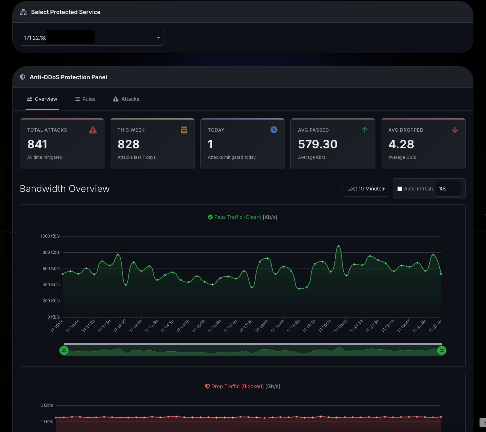
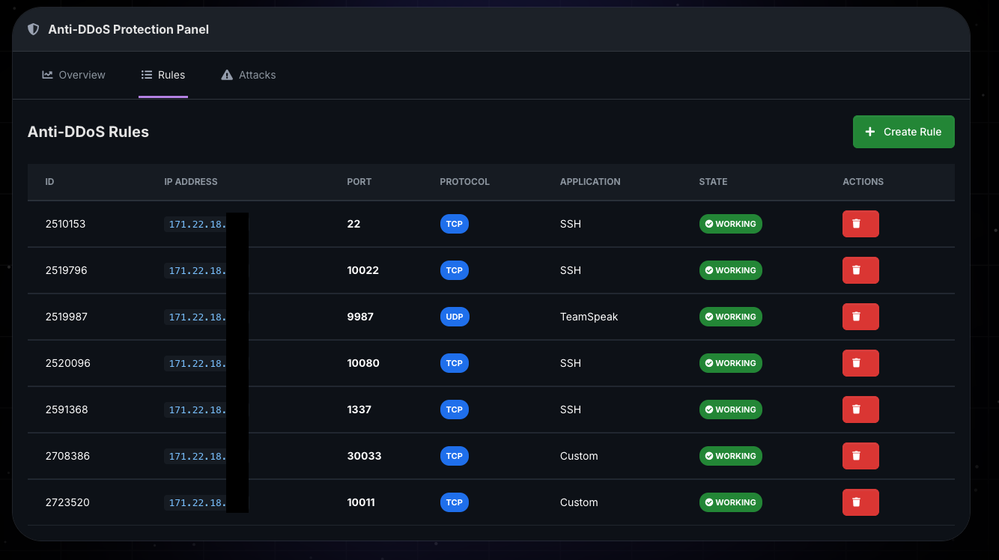
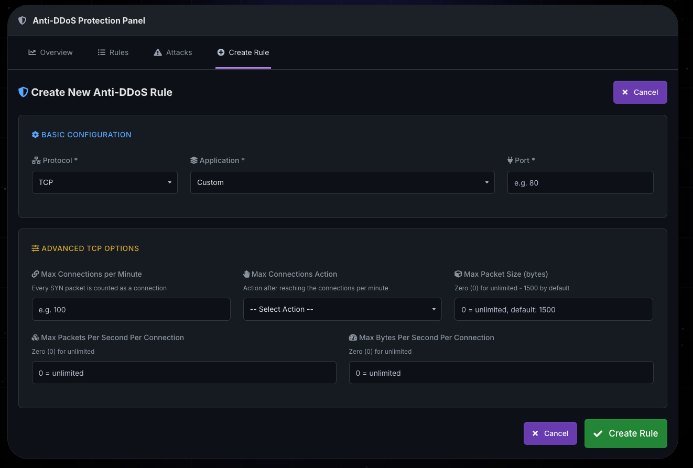
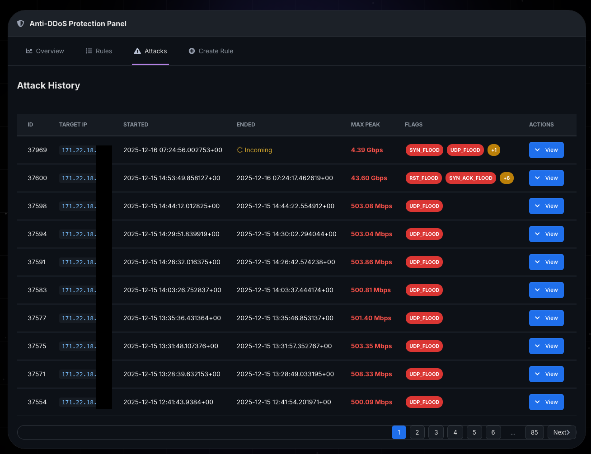
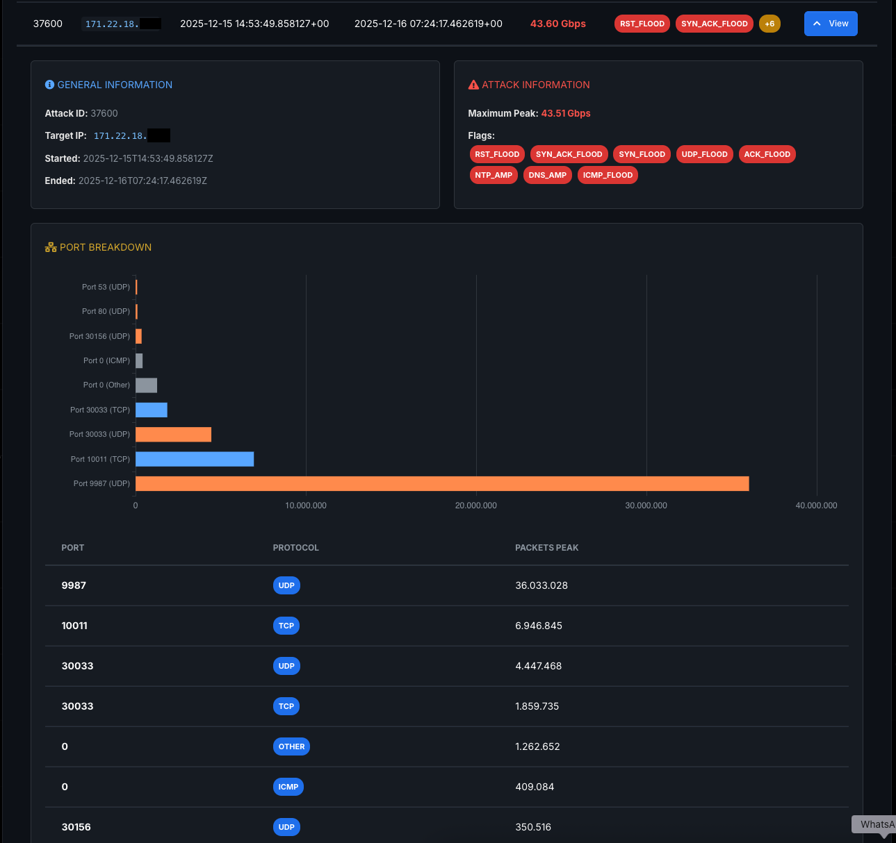

# Anti-DDoS Panel for WHMCS

This project integrates the [PletX API](https://pletx.net) with WHMCS, allowing you to manage Anti-DDoS protection rules, monitor attacks, and view traffic statistics directly through your WHMCS Client Area interface.

## Features

### Rule Management
- **Service Selection:** Select the protected IP/service from a dropdown menu to manage its Anti-DDoS rules.
- **Create Custom Rules:** Configure protection rules with custom TCP options, including:
  - Max connections per minute with cookie challenge or drop actions
  - Max packet size limits (0-1500 bytes)
  - Max packets per second per connection
  - Max bytes per second per connection
- **Protocol & Application Support:** Create rules for TCP and UDP protocols with predefined or custom applications.
- **Real-time Monitoring:** Rules are automatically monitored for state changes (creating, working, deleting) with live updates every 2 seconds.
- **Smart Pagination:** Efficiently browse through large lists of rules with intelligent pagination that handles thousands of entries.

### Attack Monitoring & History
- **Comprehensive Attack Dashboard:** View detailed attack history including:
  - Attack ID, target IP, start/end times
  - Maximum traffic peak (automatically converted to Gbps)
  - Attack flags and signatures
  - Port breakdown with visual charts
- **Expandable Attack Details:** Click on any attack to view:
  - Protocol distribution (TCP/UDP)
  - Port-level statistics with interactive ECharts visualizations
  - Packets peak per port with color-coded protocols
- **Real-time Updates:** Ongoing attacks are marked as "Incoming" with live status indicators.
- **Advanced Visualization:** Interactive horizontal bar charts showing attack distribution across ports.

### Traffic Overview & Analytics
- **Bandwidth Monitoring:** Dual charts showing:
  - Pass Traffic (Clean) - legitimate traffic allowed through
  - Drop Traffic (Blocked) - malicious traffic blocked by DDoS protection
- **Flexible Time Ranges:** View statistics for:
  - Last 10 minutes
  - Last hour
  - Last day
  - Last week
- **Auto-refresh:** Configurable auto-refresh intervals (10s, 30s, 1m, 5m) to monitor traffic in real-time.
- **Interactive Charts:** Zoom, pan, and explore traffic data with synchronized chart controls powered by ECharts.
- **Traffic Statistics Widgets:** View at-a-glance metrics including:
  - Total attacks (all time)
  - Attacks this week
  - Attacks today
  - Average passed traffic
  - Average dropped traffic

### Security & Access Control
- **IP Ownership Verification:** Automatic verification ensures clients can only manage IPs associated with their WHMCS services.
- **Comprehensive Audit Logging:** All actions are logged with:
  - Timestamp, user ID, and source IP
  - Action performed and target IP
  - Request data and response summary
  - User agent and session information
- **Granular Permissions:** IP prefix filtering allows administrators to restrict which IP ranges clients can manage.

### Modern UI/UX
- **Dark Theme Interface:** GitHub-inspired dark theme optimized for extended viewing sessions.
- **Responsive Design:** Fully responsive layout that works on desktop, tablet, and mobile devices.
- **Smart Pagination:** When dealing with high-volume attacks, pagination intelligently shows only relevant page numbers with ellipsis notation (e.g., "1 ... 48 49 [50] 51 52 ... 100").
- **Loading Indicators:** Visual feedback for all async operations to improve user experience.
- **Toast Notifications:** Non-intrusive notifications for success, error, and info messages using Toastr.

## Screenshots







## Installation

1. **Clone the Repository**

   Clone or download the repository into your WHMCS `/modules/addons/` directory:
   ```bash
   cd /path/to/whmcs/modules/addons/
   git clone https://github.com/hostealo-org/PletX-Module-for-WHMCS.git antiddos_panel
   ```

2. **Name the Module Folder**

   Ensure the addon's folder is named exactly `antiddos_panel`. WHMCS will not detect the module if the folder name differs.

3. **Activate the Module in WHMCS**

   - Log in to your WHMCS Admin Area
   - Navigate to **Setup → Addon Modules**
   - Find "Anti-DDoS Panel" in the list
   - Click **Activate**

4. **Configure Module Settings**

   After activation, configure the following settings:

   - **PletX API URL:** Base URL for the PletX API (default: `https://api.pletx.net`)
   - **PletX API Key:** Your Bearer token for PletX API authentication
   - **Allowed IP Prefixes:** Comma-separated list of IP prefixes that clients can manage
     - Example: `45.198,78.40.111,185.25`
     - This restricts which IPs clients can view and manage based on their WHMCS services

5. **Grant Client Access**

   - Check the "Access Control" box to enable client area access
   - Save the configuration

6. **Verify Installation**

   - Log in to the WHMCS Client Area
   - Navigate to **Addons → Anti-DDoS Panel**
   - You should see the service selector if you have eligible services

## Requirements

- **WHMCS:** Version 7.0 or higher
- **PHP:** Version 7.4 or higher
- **PHP Extensions:**
  - cURL (for API requests)
  - JSON
  - PDO (for database operations)
- **PletX API:** Active API key with appropriate permissions
- **Browser:** Modern browser with JavaScript enabled for interactive charts

## Configuration

### Admin Settings

Located in **Setup → Addon Modules → Anti-DDoS Panel**:

| Setting | Description | Example |
|---------|-------------|---------|
| PletX API URL | Base URL for PletX API | `https://api.pletx.net` |
| PletX API Key | Bearer token for authentication | `your-api-key-here` |
| Allowed IP Prefixes | IP ranges clients can manage | `45.198,78.40.111` |

### IP Prefix Filtering

Configure which IP ranges your clients can manage by adding IP prefixes to the "Allowed IP Prefixes" setting. Examples:

```
45.198,78.40.111,171.22.18,79.110.63
```

Only IPs starting with these prefixes will be shown to clients. This ensures clients can only manage their own infrastructure.

### Auto-refresh Configuration

Clients can configure auto-refresh in the Overview tab:
- Toggle auto-refresh on/off
- Select interval: 10s, 30s, 1m, or 5m
- Auto-refresh only active when Overview tab is visible
- Automatically stops when switching to other tabs

## Usage

The module provides several AJAX actions accessible through the client area interface:

### Rule Management Actions
- **getApplications:** Retrieves the list of available applications/presets for rule creation.
- **getRules:** Fetches rules for a specific IP with pagination support (10 items per page).
- **createRule:** Creates a new Anti-DDoS rule with custom or predefined settings.
  - Supports custom TCP options: max connections, packet size, bytes/packets per second
  - Application ID, IP, and port are required
- **deleteRule:** Removes a rule by ID with automatic ownership verification.

### Attack Monitoring Actions
- **getAttacks:** Retrieves paginated attack history for the selected IP.
  - Returns attack ID, timestamps, peak traffic, and flags
  - Supports pagination (10 items per page by default)
- **getAttackDetails:** Fetches detailed information about a specific attack:
  - Port breakdown with packet statistics
  - Protocol distribution
  - Interactive visualizations

### Analytics Actions
- **getOverview:** Retrieves bandwidth data (pass/drop traffic) for specified time periods.
  - Supports 10m, 1h, 1d, 1w periods
  - Returns time-series data for chart visualization
  - Calculates average passed and dropped traffic

### Service Management
- **getPrefixes:** Lists available IP prefixes (admin reference).

All actions include:
- Automatic IP ownership verification
- Comprehensive error handling
- Detailed audit logging to `/module_logs/` directory
- Session-based authentication

## API Endpoints

The module uses the following PletX API endpoints:

- `GET /services/applications` - List available applications and protocols
- `GET /services/attacks` - List attacks with pagination and filtering
- `GET /services/attacks/{id}/details` - Get detailed attack information
- `GET /services/overview` - Get bandwidth overview with time-series data
- `GET /services/prefixes` - List service IP prefixes
- `GET /services/rules` - List rules with pagination and search
- `POST /services/rules` - Create new protection rule
- `DELETE /services/rules/{id}` - Delete rule by ID
- `DELETE /services/rules` - Delete rules by IP/port/protocol combination

## File Structure

```
antiddos_panel/
├── antiddos_panel.php       # Main module configuration
├── ajax.php                 # AJAX request handler
├── lib/
│   └── PletXAPIClient.php   # PletX API client library
├── templates/
│   ├── overview.tpl         # Main UI template
│   └── error.tpl            # Error page template
├── module_logs/                    # Log files (auto-created)
├── .gitignore              # Git ignore rules
└── README.md               # This file
```

## Logging

All actions are logged to the `module_logs/` directory for audit and debugging purposes:

- `module_logs/master.log` - All actions
- `module_logs/{action}.log` - Specific action logs
- Logs include: timestamp, user ID, IP address, request data, and response

## Theme Compatibility

This module is optimized for the **Lagom2** theme and modern WHMCS client area themes. The interface includes:

- GitHub-inspired dark theme styling
- Bootstrap compatible components
- FontAwesome icons (included via CDN)
- ECharts for interactive visualizations
- Toastr for notifications
- Responsive grid layouts

If you're using a different theme, you may need to adjust the template files or add custom CSS to ensure proper display. The module's CSS is scoped to `.antiddos-container` to prevent conflicts with existing styles.

## Security Considerations

### API Security
- **Secure Storage:** Store your PletX API key securely in WHMCS addon settings (never in code or version control).
- **HTTPS Only:** Always use HTTPS for API communications to prevent man-in-the-middle attacks.
- **Token Protection:** API keys are never exposed in client-side code or browser logs.

### Access Control
- **IP Ownership Verification:** Every action verifies that the client owns the IP through WHMCS services before proceeding.
- **IP Prefix Filtering:** Administrators can restrict which IP ranges are manageable via the allowed prefixes setting.
- **Rule Verification:** When deleting rules, the module verifies the rule belongs to the client's IP to prevent unauthorized deletions.
- **Session-based Auth:** Uses native WHMCS session handling for authentication.

### Audit Logging
- **Comprehensive Logs:** All actions are logged to `/module_logs/` directory with:
  - Action-specific log files (e.g., `createRule.log`, `getAttacks.log`)
  - Master log file with all events (`master.log`)
  - PHP error log integration for critical errors
- **Logged Information:**
  - Timestamp and user identification
  - Source IP and user agent
  - Action performed and target IP
  - Request parameters and response summary
  - Session ID for tracking
- **Unauthorized Access Tracking:** Failed authorization attempts are logged with full context for security auditing.

### Data Validation
- **Input Sanitization:** All user inputs are validated and sanitized before processing.
- **Type Checking:** Strict type validation for numeric values (IDs, ports, etc.).
- **Error Handling:** Graceful error handling prevents information disclosure.

## Troubleshooting

### Common Issues

**Module not appearing in Client Area:**
- Verify the module is activated in Admin Area
- Check "Access Control" is enabled in module settings
- Ensure client has services with IPs matching allowed prefixes
- Verify the client has an active WHMCS session

**API Errors:**
- Verify API URL is correct (no trailing slash): `https://api.pletx.net`
- Check API key has proper permissions in PletX dashboard
- Review logs in `/module_logs/master.log` for detailed error messages
- Ensure cURL extension is enabled in PHP

**Rules not updating:**
- Rules in "creating" state may take up to 30 seconds to activate
- Check PletX API status and availability
- Review `module_logs/createRule.log` for specific errors
- Verify rule parameters are within acceptable ranges

**Charts not loading:**
- Ensure ECharts CDN (`cdn.jsdelivr.net`) is accessible from client browser
- Check browser console (F12) for JavaScript errors
- Verify service has traffic data for selected period
- Clear browser cache and reload

**Attacks not displaying:**
- Confirm the IP has recorded attacks in PletX dashboard
- Check pagination - attacks may be on other pages
- Review `module_logs/getAttacks.log` for API response
- Verify IP ownership and prefix filtering

### Debug Logging

All actions are logged to `/modules/addons/antiddos_panel/module_logs/`:

```
module_logs/
├── master.log          # All actions chronologically
├── getAttacks.log      # Attack query logs
├── createRule.log      # Rule creation logs
├── deleteRule.log      # Rule deletion logs
├── getOverview.log     # Traffic data queries
└── UNAUTHORIZED_*.log  # Failed access attempts
```

Each log entry includes:
- Timestamp and user information
- Request data and parameters
- Response summary (success/error)
- Session and user agent details
- Full request URI

To enable more verbose debugging, check PHP error logs and WHMCS system logs.

## Performance Optimization

The module includes several optimizations for handling high-traffic scenarios:

- **Smart Pagination:** Efficiently handles thousands of attacks/rules without performance degradation
- **Conditional Loading:** Charts and attack details load on-demand, not preemptively
- **Auto-refresh Control:** Automatically stops refreshing when not viewing active tabs
- **Optimized Queries:** Filtered API requests reduce unnecessary data transfer
- **Caching:** Chart instances are reused when possible
- **Synchronized Zoom:** Dual charts share zoom state for better UX without duplication

## Contributing

Contributions, issues, and feature requests are welcome!

To contribute:
1. Fork the repository
2. Create a feature branch (`git checkout -b feature/AmazingFeature`)
3. Commit your changes (`git commit -m 'Add some AmazingFeature'`)
4. Push to the branch (`git push origin feature/AmazingFeature`)
5. Open a Pull Request

Please ensure:
- Code follows existing style and conventions
- All new features include appropriate error handling
- Security considerations are addressed
- Documentation is updated

## Acknowledgements

This module has been developed and maintained by [**Hostealo.es**](https://hostealo.es), a provider specialized in high-availability hosting and DDoS mitigation solutions.

**Hostealo.es** offers:
- Professional DDoS protection services
- High-performance dedicated servers
- Colocation services across multiple datacenters
- 24/7 technical support in Spanish and English
- Custom WHMCS module development
- Network infrastructure consulting

For support, inquiries, or custom development requests, please visit our website or contact us directly at [contacto@hostealo.es](mailto:contacto@hostealo.es).

### Technology Stack

- **PletX API** - DDoS protection backend
- **WHMCS** - Billing and client management
- **ECharts** - Interactive data visualization
- **Bootstrap** - Responsive UI framework
- **FontAwesome** - Icon library
- **Toastr** - Notification system

## License

This project is licensed under the [MIT License](LICENSE).

```
MIT License

Copyright (c) 2025 Hostealo.es

Permission is hereby granted, free of charge, to any person obtaining a copy
of this software and associated documentation files (the "Software"), to deal
in the Software without restriction, including without limitation the rights
to use, copy, modify, merge, publish, distribute, sublicense, and/or sell
copies of the Software, and to permit persons to whom the Software is
furnished to do so, subject to the following conditions:

The above copyright notice and this permission notice shall be included in all
copies or substantial portions of the Software.

THE SOFTWARE IS PROVIDED "AS IS", WITHOUT WARRANTY OF ANY KIND, EXPRESS OR
IMPLIED, INCLUDING BUT NOT LIMITED TO THE WARRANTIES OF MERCHANTABILITY,
FITNESS FOR A PARTICULAR PURPOSE AND NONINFRINGEMENT. IN NO EVENT SHALL THE
AUTHORS OR COPYRIGHT HOLDERS BE LIABLE FOR ANY CLAIM, DAMAGES OR OTHER
LIABILITY, WHETHER IN AN ACTION OF CONTRACT, TORT OR OTHERWISE, ARISING FROM,
OUT OF OR IN CONNECTION WITH THE SOFTWARE OR THE USE OR OTHER DEALINGS IN THE
SOFTWARE.
```

---
